# Scoring Pipeline — Complete Step-by-Step Guide

> How raw market data becomes a `STRONG BUY / BUY / HOLD / SELL / STRONG SELL` recommendation with a confidence score and risk parameters.
> 
> All numerical examples use **BHP.AX** (BHP Group) as an illustrative ASX stock. Values are fictional but realistic.

---

## High-Level Overview

```
┌─────────────────────────────────────────────────────────────────────────────┐
│  STAGE 1        STAGE 2       STAGE 3        STAGE 4        STAGE 5        │
│  Data Fetch  →  Sentiment  →  Macro Context → Technicals  →  Signal Engine │
│  (parallel)     Scoring       Building       Calculation    (scoring.js)    │
│                                                                             │
│  STAGE 6        STAGE 7                                                     │
│  Score Sum   →  Action / Confidence / Risk                                  │
└─────────────────────────────────────────────────────────────────────────────┘
```

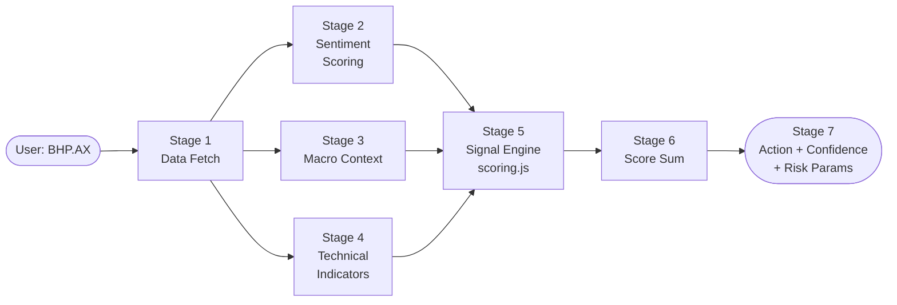

---

## Stage 1 — Parallel Data Fetch

ASX tickers (e.g. `BHP.AX`) are routed to **Yahoo Finance** because the ticker contains a `.` character.
All 13 data requests are fired **concurrently** via `Promise.all`.

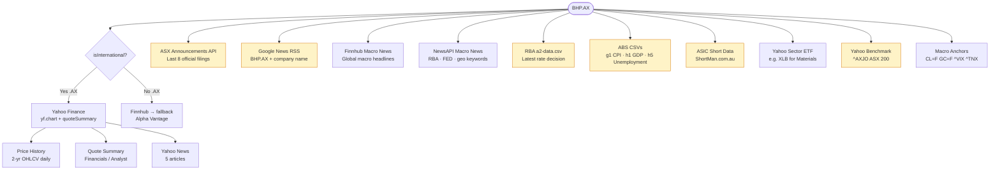

> 🟡 Yellow nodes are **ASX-only** data sources not fetched for US tickers.

### What each source provides

| Source | Key Fields Used in Scoring |
|--------|---------------------------|
| Yahoo Chart (2 yr OHLCV) | `price`, `ma20/50/200`, `rsi`, `priceHistory` |
| Yahoo quoteSummary | `pe`, `eps`, `roe`, `fcf`, `analystConsensus`, `earningsSurprise`, `targetMeanPrice` |
| Yahoo News | Company news headlines → sentiment scoring |
| **ASX Announcements** | Official filings → merged into company news |
| **Google News RSS** | Supplemental company news |
| Finnhub / NewsAPI Macro | Global macro headlines → macro context |
| **RBA a2-data.csv** | Rate change direction → `bias` (EASING / TIGHTENING / HOLD) |
| **ABS g1-data.csv** | `cpi`, `trimmedMean` |
| **ABS h1-data.csv** | `gdpGrowth` |
| **ABS h5-data.csv** | `unemploymentRate` |
| **ASIC ShortSelling** | `shortPercent` (short interest %) |
| Yahoo Sector ETF | Sector trend direction |
| Yahoo ^AXJO | ASX 200 benchmark trend |
| Macro Anchors | 90-day trend for `CL=F` `GC=F` `^VIX` `^TNX` |

---

## Stage 2 — Sentiment Scoring

### 2A. Company News Sentiment → `sentimentScore`

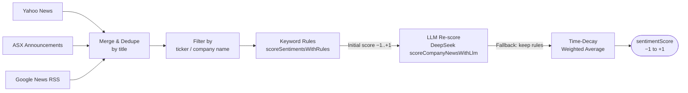

**Time-decay formula** (`calculateTimeDecayedSentiment`, `lambda = 0.2`):

```
weight_i  = e^(−0.2 × daysAgo_i)

sentimentScore = Σ(score_i × weight_i) / Σ(weight_i)
```

**Example (BHP.AX):**

| Article | LLM Score | Age | Weight `e^(−0.2×d)` | Contribution |
|---------|-----------|-----|----------------------|-------------|
| "BHP beats iron ore forecast" | +0.65 | 1 day | 0.82 | +0.533 |
| "BHP faces environmental probe" | −0.45 | 4 days | 0.45 | −0.203 |
| "Mining sector outlook positive" | +0.20 | 2 days | 0.67 | +0.134 |
| **Sum / Total Weight** | | | **1.94** | **+0.464** |

`sentimentScore = 0.464 / 1.94 ≈ +0.24` → **NEUTRAL** (threshold ±0.3, signal **not** triggered)

### 2B. Macro News Sentiment → `macroContext.sentimentScore`

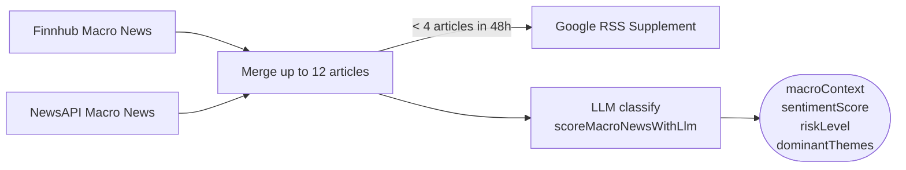

LLM assigns each article:
- **`theme`**: `GEOPOLITICS` · `MONETARY_POLICY` · `POLITICS_POLICY` · `ENERGY_COMMODITIES` · `MARKET_STRESS` · `SUPPLY_CHAIN` · `GENERAL_MACRO`
- **`marketTone`**: `RISK_ON` · `RISK_OFF` · `BALANCED`

---

## Stage 3 — Macro Context Building

### 3A. RBA Rate Decision (ASX only)

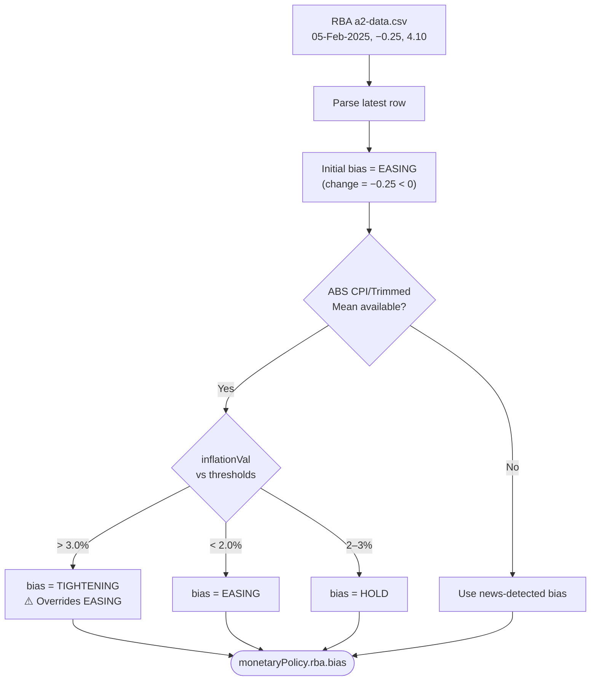

> **Key insight for ASX stocks:** Even if the RBA just cut rates, if `CPI > 3.0%` the ABS data overrides the bias to `TIGHTENING`. This is intentional — it reflects that inflation pressure dominates the forward rate outlook.

### 3B. ABS Macro Indicators path

| ABS File | Parsed Field | Primary Use |
|----------|-------------|-------------|
| `g1-data.csv` | `cpi` | → RBA bias override **+** `High CPI Inflation` signal in scoring |
| `g1-data.csv` | `trimmedMean` | Same as CPI but preferred (more stable core inflation) |
| `h5-data.csv` | `unemploymentRate` | → `Tight Labor Market` signal in scoring |
| `h1-data.csv` | `gdpGrowth` | → `marketContext` text only (no direct score impact today) |

### 3C. Final macroContext structure

```js
macroContext = {
  available: true,
  sentimentScore: +0.05,         // raw macro news sentiment
  riskLevel: 'MEDIUM',           // HIGH triggers risk-off penalty
  dominantThemes: [
    { theme: 'MONETARY_POLICY', count: 2 },
    { theme: 'ENERGY_COMMODITIES', count: 1 }
  ],
  monetaryPolicy: {
    rba: { bias: 'TIGHTENING', ... },  // ← ABS-overridden
    fed: { bias: 'HOLD', ... }
  },
  macroIndicators: {
    available: true,
    cpi: 3.5,         trimmedMean: 3.2,
    gdpGrowth: 1.2,   unemploymentRate: 3.8
  }
}
```

---

## Stage 4 — Technical Indicator Calculation

All computed from the **2-year daily OHLCV price history** inside `calculateAllIndicators()`.

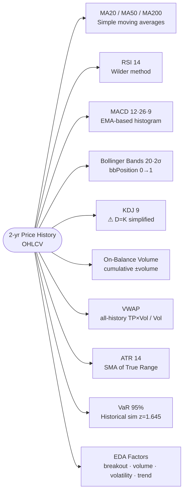

### EDA Factors detail

| Factor | Formula | BHP Example | Signal |
|--------|---------|-------------|--------|
| `breakout20Pct` | `(close − highest20) / highest20 × 100` | +1.64% | `BULLISH_BREAKOUT` (>1%) |
| `volumeRatio` | `todayVol / avgVol20` | 1.45× | `HIGH` (≥1.3) |
| `volatility20` | annualised 20-day log-return σ | 28.5% | `NORMAL` (18–40%) |
| `trendStrengthPct` | `(MA20 − MA50) / MA50 × 100` | +3.3% | `STRONG_UP` (>2%) |

---

## Stage 5 — Signal Engine (`scoring.js`)

Every signal calls:
```js
add(name, points, reason, detail, bucket)
```
`points` is first looked up from `signal-weights.json` via `getSignalWeight(key)`, then scaled by `profile.signalMultipliers[bucket]` (from the **time horizon profile**):

| Time Horizon | SHORT | MEDIUM | LONG |
|---|---|---|---|
| Trend multiplier | 0.8 | **1.0** | 1.2 |
| Oscillator multiplier | 1.2 | **1.0** | 0.6 |
| Fundamental multiplier | 0.6 | **1.0** | 1.5 |
| Momentum multiplier | 1.5 | **1.0** | 0.5 |
| Macro multiplier | 1.0 | **1.0** | 1.0 |

---

### Signal Group 1 — Trend (bucket: `trend` / `longTrend`)

```
price = $43.50    ma50 = $40.80    ma200 = $38.50
```

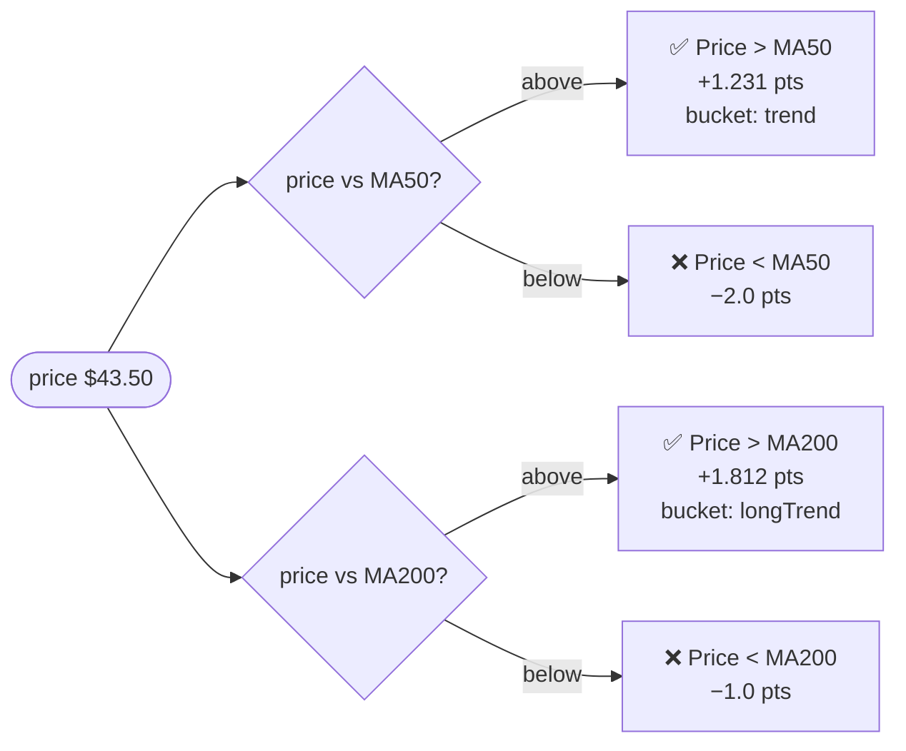

| Signal | Condition | Weight Key | Score |
|--------|-----------|-----------|-------|
| Price > MA50 | $43.50 > $40.80 ✓ | `trend_ma50_bullish` = 1.231 | **+1.231** |
| Price > MA200 | $43.50 > $38.50 ✓ | `trend_ma200_bullish` = 1.812 | **+1.812** |

**Subtotal: +3.043**

---

### Signal Group 2 — RSI Oscillator (bucket: `oscillator`)

**Adaptive thresholds** — the overbought level adjusts based on trend context:

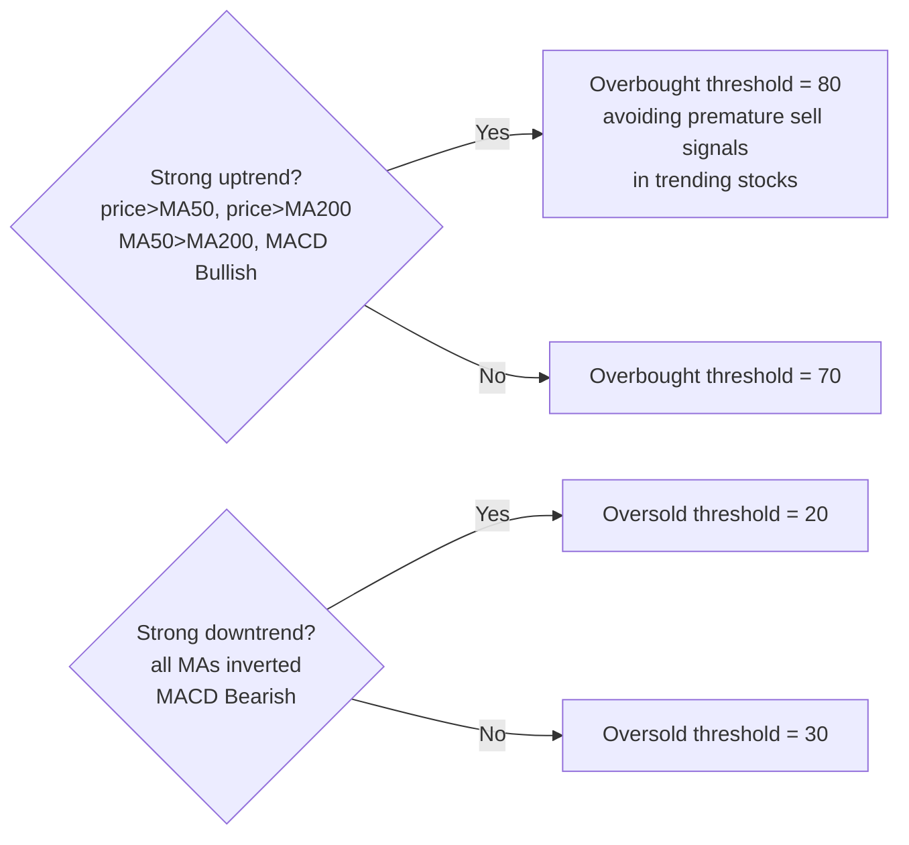

| Condition | BHP | Signal | Weight | Score |
|-----------|-----|--------|--------|-------|
| RSI < oversold threshold (30) | 58.3 > 30 ✗ | — | — | — |
| RSI > overbought threshold (80, adjusted) | 58.3 < 80 ✗ | — | — | — |
| RSI in healthy zone [45, 65] | 58.3 ∈ [45,65] ✓ | RSI Healthy | `rsi_healthy` = 0.695 | **+0.695** |

**Subtotal: +0.695**

---

### Signal Group 3 — Sentiment & Short Interest (bucket: `sentiment`)

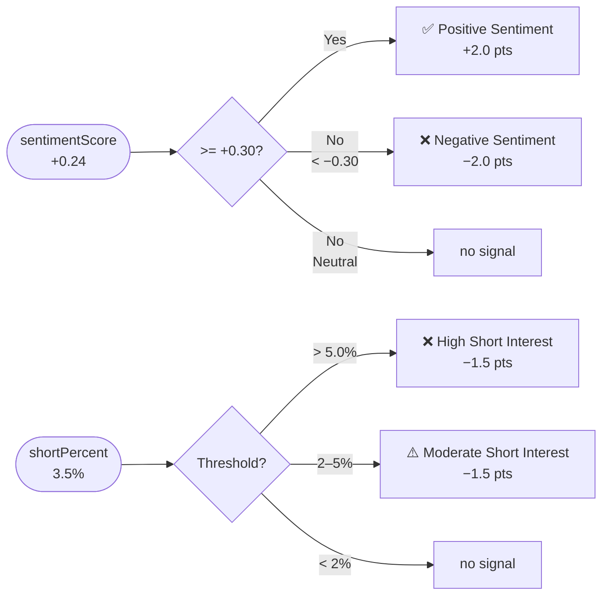

| Signal | Value | Score |
|--------|-------|-------|
| Positive Sentiment | +0.24 < 0.3 threshold ✗ | 0 |
| Moderate Short Interest | 3.5% ∈ (2%, 5%) ✓ | **−1.500** |

**Subtotal: −1.500**

---

### Signal Group 4 — Macro (bucket: `macro`)

This is the most complex group, with 6 sub-layers evaluated in sequence:

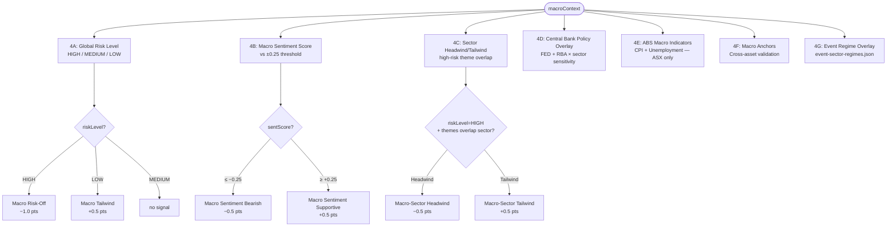

#### 4A. Global Risk Level

`riskLevel = 'MEDIUM'` → **no signal triggered** (needs HIGH or LOW)

#### 4B. Macro Sentiment

`sentimentScore = +0.05` → below ±0.25 threshold → **no signal**

#### 4C. Sector Headwind / Tailwind

```js
sectorHeadwindThemes = {
  Technology: ['SUPPLY_CHAIN', 'POLITICS_POLICY', 'MONETARY_POLICY'],
  Semiconductors: ['SUPPLY_CHAIN', 'POLITICS_POLICY', 'GEOPOLITICS'],
  Financials: ['MONETARY_POLICY', 'MARKET_STRESS', 'POLITICS_POLICY'],
  Energy: ['MARKET_STRESS'],          // only demand-destruction is a headwind
  'Automotive/EV': ['SUPPLY_CHAIN', 'ENERGY_COMMODITIES', 'POLITICS_POLICY'],
  Industrials: ['SUPPLY_CHAIN', 'MARKET_STRESS'],
  Healthcare: ['POLITICS_POLICY', 'MARKET_STRESS'],
  // ⚠ Mining / Materials not defined → no headwind/tailwind triggered
}
```

`sector = 'Mining'` → not in the map → **no signal** (known gap)

#### 4D. Central Bank Policy Overlay

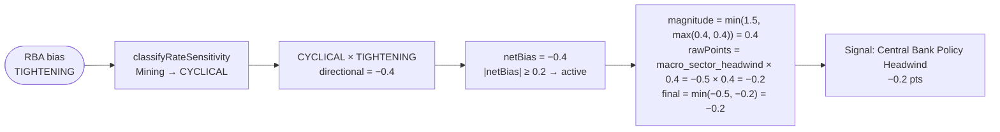

Rate-sensitivity classification:

| Category | Sectors | FED/RBA Easing | FED/RBA Tightening |
|----------|---------|-----------------|---------------------|
| GROWTH | Technology, Semiconductors, Healthcare, Consumer Discretionary | +1.0 | −1.0 |
| DEFENSIVE | Utilities, Real Estate, Consumer Staples | +0.8 | −0.8 |
| FINANCIALS | Financials | −0.5 | +0.5 |
| CYCLICAL | Industrials, Materials, Energy | +0.4 | −0.4 |
| NEUTRAL | Others | +0.25 | −0.25 |

> Note: **RBA only affects ASX tickers** (`*.AX`). FED affects all tickers.

Score = **−0.200**

#### 4E. ABS Macro Indicators (ASX only)

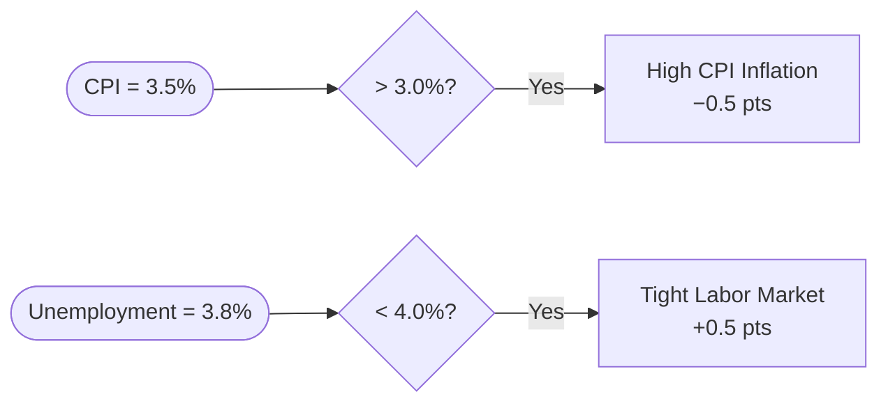

| Signal | Condition | Score |
|--------|-----------|-------|
| High CPI Inflation (ABS) | 3.5% > 3.0% ✓ | **−0.500** |
| Tight Labor Market (ABS) | 3.8% < 4.0% ✓ | **+0.500** |

#### 4F. Macro Anchors (Cross-Asset Validation)

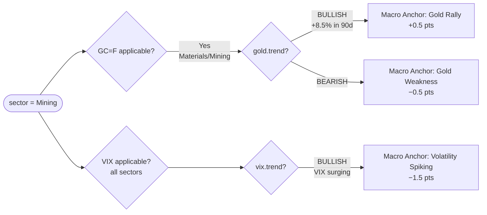

Applicable anchor rules:

| Sector | Anchor | Bullish Signal | Bearish Signal |
|--------|--------|---------------|----------------|
| Energy | CL=F (Oil) | +0.5 | −0.5 |
| Materials / Mining | GC=F (Gold) | +0.5 | −0.5 |
| Financials | ^TNX (10Y Yield) | +0.5 (rates rising = margin expansion) | —|
| All sectors | ^VIX | — | −1.5 (if VIX BULLISH = risk-off spike) |
| Technology / Growth | ^TNX | — | −0.5 (rising rates = growth discount) |

`gold.trend = 'BULLISH'` (90-day change = +8.5% > 5% threshold) → **+0.500**

#### 4G. Event Regime Overlay (`event-sector-regimes.json`)

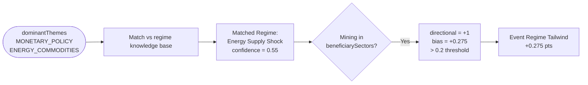

Confidence formula:
```
confidence = (themeMatches > 0 ? 0.55 : 0)
           + min(0.35, keywordMatches × 0.08)
           + (riskLevel = HIGH ? 0.10 : 0)
```

Score = **+0.275**

**Macro group subtotal: −0.2 + (−0.5 + 0.5) + 0.5 + 0.275 = +0.575**

---

### Signal Group 5 — Analyst (bucket: `analyst`)

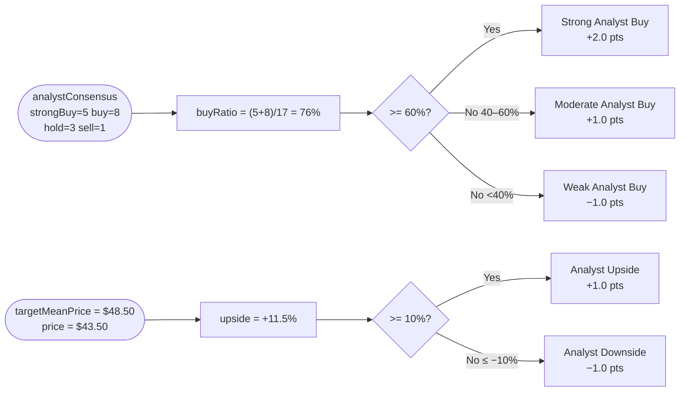

| Signal | Condition | Score |
|--------|-----------|-------|
| Strong Analyst Buy | buyRatio = 76% ≥ 60% ✓ | **+2.000** |
| Analyst Upside | upside = +11.5% ≥ 10% ✓ | **+1.000** |

**Subtotal: +3.000**

---

### Signal Group 6 — Fundamentals / Valuation (bucket: `valuation` / `fundamental`)

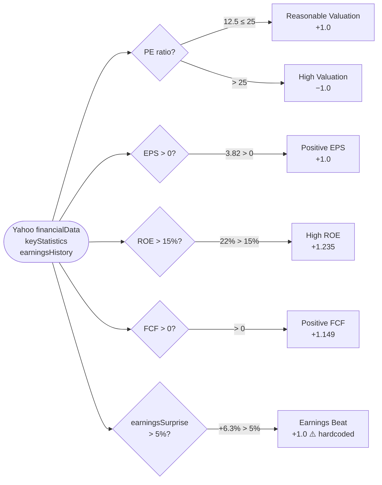

> ⚠️ **Known Issue:** `earnings_beat` and `earnings_miss` use hardcoded ±1 in `scoring.js` but the calibrated weight in `signal-weights.json` is `0.0`. The hardcoded value takes precedence.

| Signal | Source | Condition | Score |
|--------|--------|-----------|-------|
| Reasonable Valuation | `keyStatistics.forwardPE` | 12.5 ≤ 25 ✓ | **+1.000** |
| Positive EPS | `keyStatistics.trailingEps` | 3.82 > 0 ✓ | **+1.000** |
| High ROE | `financialData.returnOnEquity` | 22% > 15% ✓ | **+1.000** |
| Positive FCF | `financialData.freeCashflow` | > 0 ✓ | **+1.000** |
| Earnings Beat | `earningsHistory[0].surprisePercent` | +6.3% > 5% ✓ | **+1.000** |

**Subtotal: +5.000**

---

### Signal Group 7 — Momentum (bucket: `momentum`)

| Signal | Condition | Weight | Score |
|--------|-----------|--------|-------|
| Strong Daily Momentum Up | `changePercent` = +2.3% > 1.5% ✓ | `momentum_strong_up` = 0.595 | **+0.595** |
| Strong Daily Momentum Down | — | `momentum_strong_down` = 0.38 | — |

**Subtotal: +0.595**

---

### Signal Group 8 — Technical Indicators (bucket: `technical` / `intraday`)

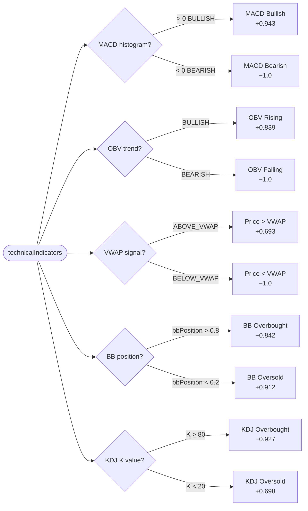

| Signal | Condition | Score |
|--------|-----------|-------|
| MACD Bullish | histogram > 0 ✓ | **+0.943** |
| OBV Rising | OBV trend = BULLISH ✓ | **+0.839** |
| Price > VWAP | close > all-history VWAP ✓ | **+0.693** |
| BB / KDJ | NEUTRAL ✗ | 0 |

**Subtotal: +2.475**

---

### Signal Group 9 — EDA Factors (bucket: `eda`)

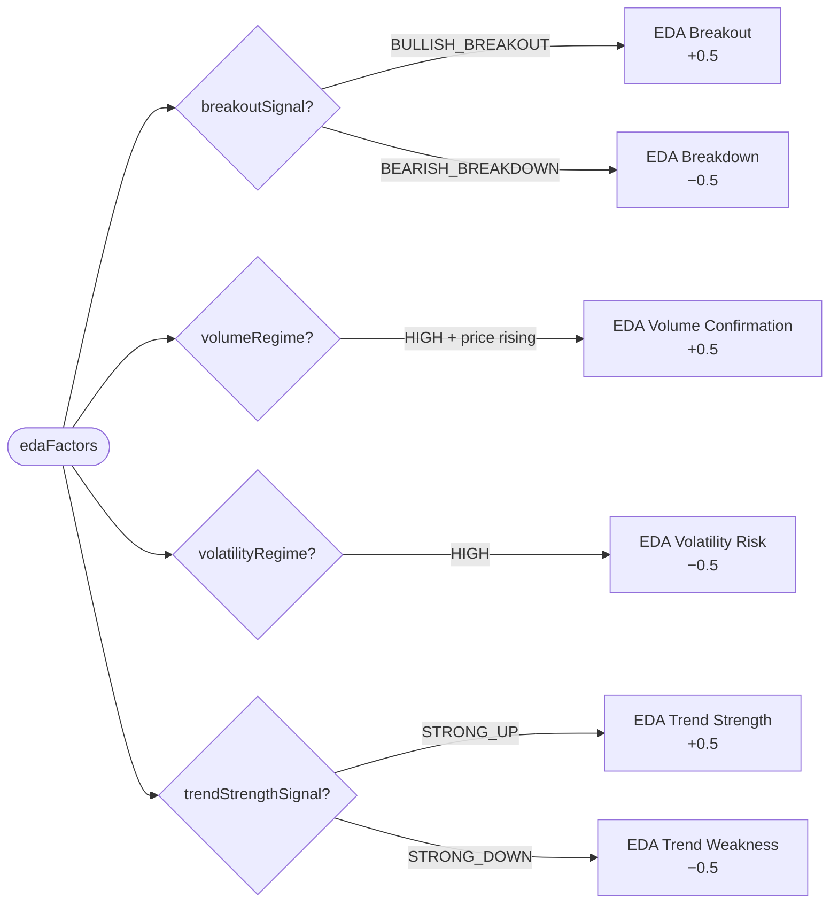

| Signal | EDA Value | Score |
|--------|-----------|-------|
| EDA Breakout | `breakout20Pct` = +1.64% → BULLISH_BREAKOUT ✓ | **+0.500** |
| EDA Volume Confirmation | `volumeRatio` = 1.45× → HIGH + price up ✓ | **+0.500** |
| EDA Trend Strength | `trendStrengthPct` = +3.3% → STRONG_UP ✓ | **+0.500** |
| EDA Volatility Risk | `volatility20` = 28.5% → NORMAL ✗ | 0 |

**Subtotal: +1.500**

---

## Stage 6 — Score Summation

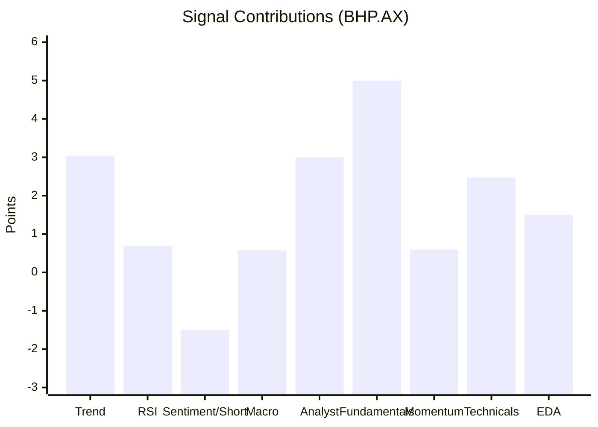

| Signal Group | Positive | Negative | Net |
|---|---|---|---|
| Trend (MA50 / MA200) | +3.043 | — | **+3.043** |
| RSI Oscillator | +0.695 | — | **+0.695** |
| Sentiment + Short Interest | — | −1.500 | **−1.500** |
| Macro (RBA / CPI / Unemployment / Gold / Regime) | +1.275 | −0.700 | **+0.575** |
| Analyst | +3.000 | — | **+3.000** |
| Fundamentals / Valuation | +5.000 | — | **+5.000** |
| Momentum | +0.595 | — | **+0.595** |
| Technical (MACD / OBV / VWAP) | +2.475 | — | **+2.475** |
| EDA Factors | +1.500 | — | **+1.500** |
| **TOTAL** | **17.583** | **−2.200** | **+15.383** |

---

## Stage 7 — Action Mapping, Confidence & Risk

### 7A. Action Mapping

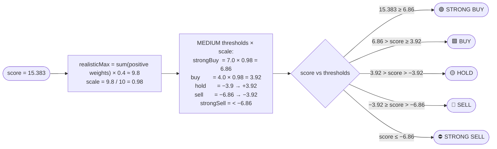

### 7B. Confidence Calculation

```
normalizedScore  = min(1.0,  |score| / getRecommendedScoreScale() )
                 = min(1.0,  15.383 / 13)  = 1.0

baseConfidence   = 42 + round(34 × tanh(normalizedScore × 1.8))
                 = 42 + round(34 × tanh(1.8))
                 = 42 + 32 = 74

alignment        = |positiveSum − |negativeSum|| / (positiveSum + |negativeSum|)
                 = |16.883 − 1.5| / 18.383 = 0.837
consistencyAdj   = round((alignment − 0.5) × 14) = round(4.72) = +5

signalCountAdj   = signalCount ≥ 10 ? +2 : 0   → +2  (19 signals triggered)

macroAdj         = riskLevel='HIGH' ? −5 : riskLevel='LOW' ? +3 : 0   → 0

confidence = 74 + 5 + 2 + 0 = 81%
           = min(92, max(30, 81)) = 81%    ← hard cap at 92%
```

### 7C. Risk Parameters (ATR-based)

```
entry  = $43.50
ATR    = calculateATR(priceHistory, period=14) = $1.23

MEDIUM time horizon multipliers:
  atrStopMultiplier   = 1.5
  atrTargetMultiplier = 2.5

stopLoss   = $43.50 − $1.23 × 1.5 = $41.66
takeProfit = $43.50 + $1.23 × 2.5 = $46.58
riskReward = ($46.58 − $43.50) / ($43.50 − $41.66) = 3.075 / 1.845 ≈ 1.7

VaR(95%)   = −2.1% per day   (normal-distribution estimate, z = 1.645)
```

---

## Final Output (Complete Signal List)

```json
{
  "ticker": "BHP.AX",
  "action": "STRONG BUY",
  "confidence": 81,
  "score": 15.4,
  "entry": 43.50,
  "stopLoss": 41.66,
  "takeProfit": 46.58,
  "riskReward": 1.7,
  "signals": [
    { "name": "Strong Analyst Buy",          "points": +2.000, "bucket": "analyst" },
    { "name": "Analyst Upside",              "points": +1.000, "bucket": "analyst" },
    { "name": "Price > MA50",                "points": +1.231, "bucket": "trend" },
    { "name": "Price > MA200",               "points": +1.812, "bucket": "longTrend" },
    { "name": "RSI Healthy",                 "points": +0.695, "bucket": "oscillator" },
    { "name": "Moderate Short Interest",     "points": -1.500, "bucket": "sentiment" },
    { "name": "Central Bank Policy Headwind","points": -0.200, "bucket": "macro" },
    { "name": "High CPI Inflation (ABS)",    "points": -0.500, "bucket": "macro" },
    { "name": "Tight Labor Market (ABS)",    "points": +0.500, "bucket": "macro" },
    { "name": "Macro Anchor: Gold Rally",    "points": +0.500, "bucket": "macro" },
    { "name": "Event Regime Tailwind",       "points": +0.275, "bucket": "macro" },
    { "name": "Reasonable Valuation",        "points": +1.000, "bucket": "valuation" },
    { "name": "Positive EPS",               "points": +1.000, "bucket": "valuation" },
    { "name": "High ROE",                    "points": +1.000, "bucket": "fundamental" },
    { "name": "Positive FCF",               "points": +1.000, "bucket": "fundamental" },
    { "name": "Earnings Beat",              "points": +1.000, "bucket": "fundamental" },
    { "name": "Strong Daily Momentum",      "points": +0.595, "bucket": "momentum" },
    { "name": "MACD Bullish",              "points": +0.943, "bucket": "technical" },
    { "name": "OBV Rising",               "points": +0.839, "bucket": "technical" },
    { "name": "Price > VWAP",             "points": +0.693, "bucket": "intraday" },
    { "name": "EDA Breakout",             "points": +0.500, "bucket": "eda" },
    { "name": "EDA Volume Confirmation",  "points": +0.500, "bucket": "eda" },
    { "name": "EDA Trend Strength",       "points": +0.500, "bucket": "eda" }
  ]
}
```

---

## Quick Reference: Data Source → Signal Map

| Raw Data | Field | Signal Triggered | Score Range |
|----------|-------|-----------------|-------------|
| Yahoo Chart | `price` vs `ma50` | Price > / < MA50 | −2.0 to +1.231 |
| Yahoo Chart | `price` vs `ma200` | Price > / < MA200 | −1.0 to +1.812 |
| Yahoo Chart | `rsi` | RSI Healthy / Oversold / Overbought | −0.85 to +0.695 |
| Yahoo Chart | MACD histogram | MACD Bullish / Bearish | −1.0 to +0.943 |
| Yahoo Chart | OBV direction | OBV Rising / Falling | −1.0 to +0.839 |
| Yahoo Chart | close vs VWAP | Price > / < VWAP | −1.0 to +0.693 |
| Yahoo Chart | BB position | BB Oversold / Overbought | −0.842 to +0.912 |
| Yahoo Chart | EDA breakout20 | EDA Breakout / Breakdown | −0.5 to +0.5 |
| Yahoo Chart | EDA volumeRatio | EDA Volume Confirmation | 0 to +0.5 |
| Yahoo Chart | EDA volatility20 | EDA Volatility Risk | 0 to −0.5 |
| Yahoo Chart | EDA trendStrength | EDA Trend Strength / Weakness | −0.5 to +0.5 |
| Yahoo Chart | `changePercent` | Strong Daily Momentum Up / Down | −0.38 to +0.595 |
| Yahoo quoteSummary | `returnOnEquity` | High ROE | 0 to +1.0 |
| Yahoo quoteSummary | `freeCashflow` | Positive FCF | 0 to +1.0 |
| Yahoo quoteSummary | `trailingEps` | Positive EPS | 0 to +1.0 |
| Yahoo quoteSummary | `forwardPE` | Reasonable / High Valuation | −1.0 to +1.0 |
| Yahoo quoteSummary | earnings surprise | Earnings Beat / Miss | −1.0 to +1.0 |
| Yahoo quoteSummary | `strongBuy+buy/total` | Strong / Moderate Analyst Buy | −1.0 to +2.0 |
| Yahoo quoteSummary | `targetMeanPrice` | Analyst Upside / Downside | −1.0 to +1.0 |
| LLM (company news) | `sentimentScore ≥ ±0.30` | Positive / Negative Sentiment | −2.0 to +2.0 |
| **ASIC ShortSelling** | **`shortPercent`** | **High / Moderate Short Interest** | **−1.5 to 0** |
| **RBA a2-data.csv** | **`change`** | → bias → policyOverlay → CB Policy signal | **−0.75 to +0.75** |
| **ABS g1-data.csv** | **`cpi > 3.0%`** | **High CPI Inflation (ABS)** | **−0.5** |
| **ABS g1-data.csv** | **`cpi > 3.0%`** | **Overrides RBA bias → TIGHTENING** | *(indirect)* |
| **ABS h5-data.csv** | **`unemploymentRate < 4.0%`** | **Tight Labor Market (ABS)** | **+0.5** |
| Macro Anchors | `GC=F trend` | Macro Anchor: Gold Rally / Weakness | −0.5 to +0.5 |
| Macro Anchors | `CL=F trend` | Macro Anchor: Oil Rally / Weakness | −0.5 to +0.5 |
| Macro Anchors | `^VIX BULLISH` | Macro Anchor: Volatility Spiking | −1.5 |
| Macro Anchors | `^TNX BULLISH` | Macro Anchor: Rates Rising (Financials +) | −0.5 to +0.5 |
| Macro context | `riskLevel` | Macro Risk-Off / Tailwind | −1.0 to +0.5 |
| Macro context | `sentimentScore ≥ ±0.25` | Macro Sentiment Bearish / Supportive | −0.5 to +0.5 |
| Macro context | themes × sector | Macro-Sector Headwind / Tailwind | −0.5 to +0.5 |
| Event regimes JSON | themes match + sector | Event Regime Tailwind / Headwind | variable |

---

## Signal Weight Reference (`signal-weights.json` v2.1)

Weights were calibrated via time-series cross-validation on 7,500 samples from `AAPL MSFT GOOGL NVDA TSLA` across 5-day, 20-day, and 60-day forward horizons.

| Signal Key | Blended Weight | H5 | H20 | H60 |
|-----------|---------------|-----|-----|-----|
| `sentiment_bullish` | +2.000 | +2.000 | +2.000 | +2.000 |
| `sentiment_bearish` | −2.000 | −2.000 | −2.000 | −2.000 |
| `analyst_buy_strong` | +2.000 | +2.000 | +2.000 | +2.000 |
| `trend_ma200_bullish` | +1.812 | +1.373 | +2.000 | +2.000 |
| `trend_ma50_bullish` | +1.231 | +1.395 | +1.386 | +0.860 |
| `short_pressure_bearish` | −1.500 | — | — | — |
| `quality_roe_high` | +1.235 | +1.501 | +1.132 | +1.107 |
| `quality_fcf_positive` | +1.149 | +1.038 | +1.384 | +0.946 |
| `macd_bullish` | +0.943 | +2.000 | +0.659 | +0.264 |
| `bb_oversold` | +0.912 | +1.151 | +1.269 | +0.197 |
| `obv_bullish` | +0.839 | +1.323 | +0.761 | +0.461 |
| `kdj_overbought` | −0.927 | −1.477 | −0.643 | −0.756 |
| `bb_overbought` | −0.842 | −0.910 | −1.212 | −0.281 |
| `rsi_overbought` | −0.850 | −1.419 | −0.761 | −0.401 |
| `vwap_above` | +0.693 | +1.055 | +0.626 | +0.419 |
| `rsi_healthy` | +0.695 | +1.168 | +0.675 | +0.250 |
| `kdj_oversold` | +0.698 | +1.329 | +0.615 | +0.179 |
| `momentum_strong_up` | +0.595 | +1.236 | +0.415 | +0.194 |
| `earnings_beat` | **0.000** | 0.000 | 0.000 | 0.000 |
| `insider_net_buy` | **0.000** | 0.000 | 0.000 | 0.000 |

> ⚠️ `earnings_beat`, `earnings_miss`, `insider_net_buy`, `insider_net_sell` were calibrated to **0.0** (insufficient predictive signal in the training set) but are currently **hardcoded ±1.0** in `scoring.js`. This inconsistency should be resolved.

---

---

## Double-Counting & Signal Redundancy Fixes

The pipeline has been optimized to resolve double-counting and correlation inflation issues across the 7 stages:

1. **Unified CPI Inflation Pressure (`macro_cpi_pressure`)**
   - **Old Behavior:** Triggered both "High CPI Inflation (ABS)" (-0.5 pts) AND "Central Bank Policy Headwind" (up to -1.5 pts) through RBA rate tightening bias, penalizing the asset twice for the same CPI print.
   - **New Behavior:** Consolidated RBA and ABS CPI inflation signals for ASX stocks. When CPI is > 3.0%, a single `Macro CPI Inflation Pressure` signal fires. The RBA component in `Central Bank Policy Headwind` is neutralized/excluded so it is only scored once.

2. **Moving Average Triple-Counting Guard**
   - **Old Behavior:** If price was above MA50 and MA200, it would fire `Price > MA50` (+1.23 pts), `Price > MA200` (+1.81 pts), AND EDA Trend Strength (+0.5 pts), scoring three separate MA-derived signals.
   - **New Behavior:** Added a guard condition to EDA Trend Strength. It is now skipped if the primary `Price > MA50` (or `Price < MA50` for downtrends) trend signal has already triggered.

3. **Separation of MACD and RSI Adaptive Thresholds**
   - **Old Behavior:** MACD bullish/bearish signals directly adjusted the RSI overbought/oversold boundaries, creating a dual benefit/penalty where MACD influenced both its own signal score and RSI's signal trigger sensitivity.
   - **New Behavior:** Removed MACD from the RSI adaptive threshold calculations. RSI boundaries now adapt purely based on MA alignment (trend direction) and EDA volatility regimes. MACD scores independently as its own signal.

4. **Consolidated Volume Signals (OBV Retention)**
   - **Old Behavior:** Volume confirmation was scored via both On-Balance Volume (OBV) trend (`OBV Rising`) AND the EDA Volume Confirmation metric (`volumeRatio > 1.3`), doubling the weight of volume direction.
   - **New Behavior:** Removed `EDA Volume Confirmation` from the engine entirely. Volume direction and trend confirmational strength is now driven solely by the robust `OBV Rising` / `OBV Falling` technical signals.

5. **Breakout & Daily Momentum Suppression**
   - **Old Behavior:** A single-day large breakout move would trigger both the `EDA Breakout` signal (+0.5 pts) and `Strong Daily Momentum` (+0.59 pts) simultaneously, inflating the score for the same single daily candle.
   - **New Behavior:** When an active `EDA Breakout` (bullish or bearish) is triggered, short-term `Daily Momentum` signals are suppressed, allowing the breakout to represent the trend change without momentum inflation.

---

## Known Limitations & Planned Improvements

| # | Issue | Severity | Fix | Status |
|---|-------|----------|-----|--------|
| 1 | **KDJ simplified**: `D = K` always (no EMA smoothing) | 🔴 High | Apply `K_t = ⅓ RSV + ⅔ K_{t-1}` smoothing | Pending |
| 2 | **earnings_beat weight conflict**: file=0, code=+1 | 🔴 High | Route through `getSignalWeight()` | Pending |
| 3 | **signal_weights_by_horizon unused**: `getSignalWeight()` reads blended weights only | 🔴 High | Pass horizon to `getSignalWeight(key, horizon)` | Pending |
| 4 | **VWAP is full-history**: semantically wrong for daily positioning | 🟡 Med | Use monthly rolling VWAP or replace with VWAP-MA | Pending |
| 5 | **RSI divergence is a proxy**: no true rsiSeries pre-calculated | 🟡 Med | Add `rsiSeries` output to `calculateAllIndicators` | Pending |
| 6 | **Mining / Materials sector missing** from headwind/tailwind map | 🟡 Med | Add entries to `sectorHeadwindThemes` | Pending |
| 7 | **Macro anchor thresholds**: VIX/TNX use ±5% price-change rule (wrong asset type) | 🟡 Med | Use absolute level + relative change dual check | Pending |
| 8 | **Calibration data**: only 5 US mega-cap tech stocks; poor generalisation to ASX | 🔴 High | Expand to 30+ cross-sector, cross-market symbols | Pending |
| 9 | **GDP not scored**: ABS `gdpGrowth` goes only to text, not signals | 🟢 Low | Add GDP signal (`gdpGrowth < 1% → negative`) | Pending |
| 10 | **institutionOwnership fetched but not scored** | 🟢 Low | Add institutional accumulation signal | Pending |

---

*Last updated: 2026-06-07 · Model calibration: v2.1-timeseries-horizon-calibrated*
